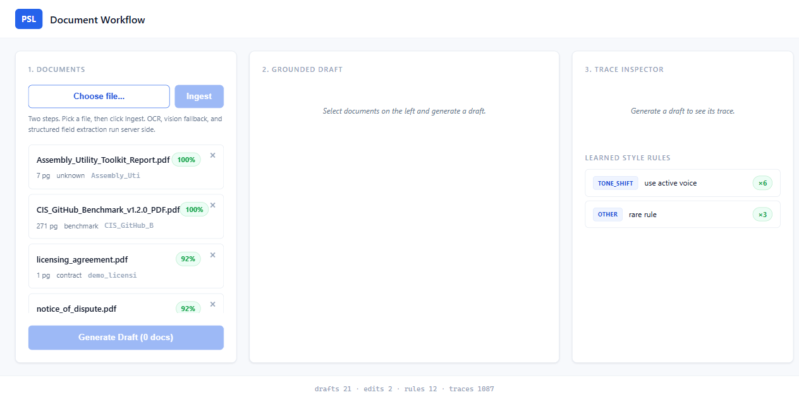
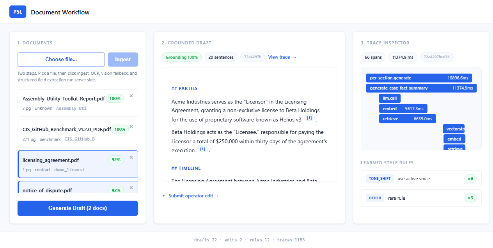
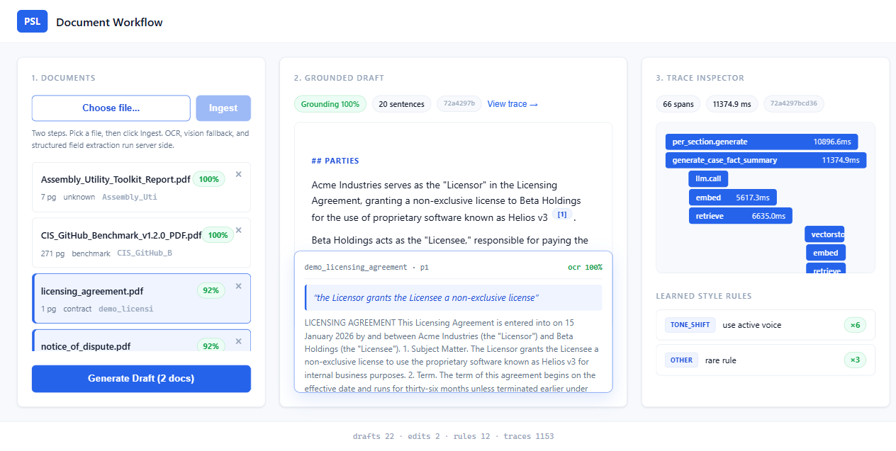
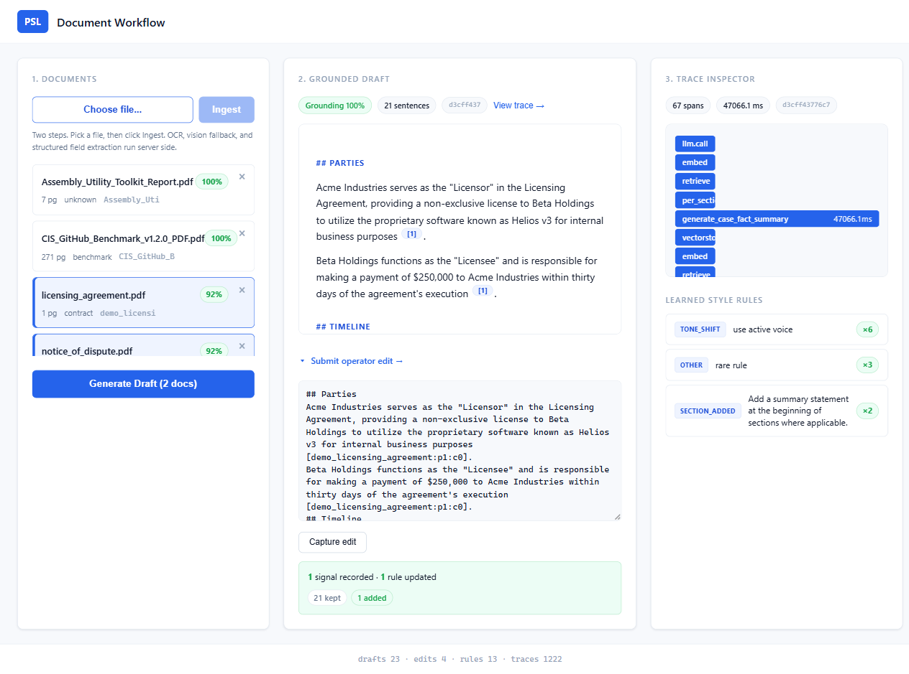

# PSL Document Workflow

An internal workflow that ingests messy legal style documents, extracts text
plus structured fields, retrieves grounded evidence, generates a Case Fact
Summary draft with inline citations, learns from operator edits, and
evaluates itself.

## Status

All five sprints are complete and the OCR stack has been hardened.

* Sprint 1. Ingestion. PDF and image inputs flow through a multi stage OCR
  pipeline, then structured field extraction.
* Sprint 2. Retrieval and grounded drafting with confidence weighted scoring.
* Sprint 3. Improvement from edits loop.
* Sprint 4. Evaluation.
* Sprint 5. UI, Docker, CI, samples, final docs, UAT.
* OCR depth pass. Sixteen techniques are layered together. See
  [OCR.md](OCR.md). The pipeline applies orientation correction, multi
  binarisation consensus, PSM auto tune, CLAHE, projection profile and
  Hough line deskew, denoise, header and footer suppression across pages,
  legal vocabulary biasing, post OCR sanity scoring, image hash caching,
  and a vision model fallback for the pages that still need it.
* Drafting depth pass. Per section generation with focused evidence, cross
  encoder reranking on the candidate pool, an LLM self review pass that
  verifies each cited sentence against its chunk and attaches the verbatim
  supporting quote, and post hoc citation parsing with strict allow listing.
* Template dispatch. The drafter picks between **Case Fact Summary** and
  **Technical Document Summary** based on the `doc_type` extracted during
  ingestion. Litigation documents (contract, notice, complaint, affidavit,
  memo) get the Parties / Timeline / Subject Matter / Material Facts /
  Uncertain layout. Technical documents (benchmark, standard, manual,
  guide, report, policy, RFC) get Document / Scope and Audience /
  Key Recommendations / Timeline of Updates / Out of Scope. The chosen
  template is recorded as `draft_type` on every Draft.

## Try it in 30 seconds (DEMO MODE)

No API key. No Tesseract install. Two synthetic documents are pre seeded and
a deterministic fake LLM stands in for the real provider so the entire
pipeline runs locally.

```powershell
.\scripts\demo.ps1
# then open http://localhost:8000
```

What you should see:

1. Two pre seeded documents in column 1 (licensing agreement and notice of
   dispute).
2. Click both, then **Generate Draft**, and a grounded Case Fact Summary
   appears with inline citations.
3. The live trace Gantt in column 3 shows every retrieval and LLM call.
4. Hover over any sentence to reveal the supporting source chunk.
5. Submit an edit, and a learned style rule appears on the right with a
   support counter.

## Live UAT screenshots

Captured live against the real OpenAI provider on a `gpt-4o-mini` run.

| State | Screenshot |
|---|---|
| Home view. Three column layout. Documents column shows ingested files with OCR confidence, doc type, and a delete control. |  |
| Grounded draft. 20 sentences, 100% grounding, 14 verbatim supporting quotes. The Trace Inspector on the right shows the per section pipeline. |  |
| Citation hover. Hovering a numbered chip reveals the verbatim supporting phrase from the source chunk along with the page and OCR confidence. |  |
| Learned style rules. After two operator edits, three rules have crossed the support threshold and now influence the next draft. |  |

## Live evaluation numbers

Produced from a real `gpt-4o-mini` run. Full report in
[eval/results.md](eval/results.md).

| Metric | Value |
|---|---|
| Grounding (LLM as judge over cited sentences) | **100%** |
| Edit loop improvement after 2 rounds | edit distance **0.407 to 0.286** (30% drop) |
| Grounded vs ablated baseline | **0 of 14** unsupported vs **15 of 21** unsupported |
| Full eval cost | **$0.035** (38 OpenAI calls, gpt-4o-mini) |

## Setup

```powershell
python -m venv .venv
.\.venv\Scripts\Activate.ps1
pip install -r requirements.txt
copy .env.example .env
# edit .env: set OPENAI_API_KEY (or ANTHROPIC_API_KEY) and TESSERACT_CMD
```

### Which LLM does it use

The system is provider agnostic. `LLM_PROVIDER=auto` (the default) resolves
based on which key you have set.

| Env state | Provider used | Default model |
|---|---|---|
| `OPENAI_API_KEY` set | OpenAI | `gpt-4o-mini` (overridable via `OPENAI_MODEL`) |
| `ANTHROPIC_API_KEY` set | Anthropic | `claude-sonnet-4-6` |
| Both set | OpenAI wins. Set `LLM_PROVIDER=anthropic` to override. | |
| Neither set | Run with `DEMO_MODE=true`. Fake provider, no key needed. | |

Swapping providers is one env var and one file each. Adding a third provider
(Mistral, local Ollama, anything else) is one class implementing
`providers/base.LLMProvider`.

### Install Tesseract on Windows

```powershell
winget install --id UB-Mannheim.TesseractOCR
```

Set `TESSERACT_CMD` in `.env` to the resulting `tesseract.exe` path. The OCR
layer (deskew, denoise, multi variant binarisation, PSM auto tune, sanity
scoring) is documented in [OCR.md](OCR.md).

## End to end CLI walkthrough

```powershell
# 1. process a document  (Sprint 1)
python -m ingestion.run data\samples\notice.pdf

# 2. index the processed JSON  (Sprint 2)
python -m retrieval.ingest data\processed\notice_<hash>.json

# 3. generate a grounded draft  (Sprint 2)
python -c "from drafting.generator import generate_case_fact_summary; \
print(generate_case_fact_summary(['notice_<hash>']).text)"

# 4. submit an operator edit  (Sprint 3)
#    sentence diff classified, style rules updated, exemplar saved
python -c "from edits.capture import capture_edit; \
print(capture_edit('<draft_id>', open('edited_draft.md').read()))"

# 5. evaluate  (Sprint 4)
python -m eval.run --docs notice_<hash> --rounds 3 --out eval\results.md
```

## HTTP API

```powershell
uvicorn api.main:app --reload
```

| Method and path | Sprint | Purpose |
|---|---|---|
| `POST /ingest` (multipart) | 1 plus 2 | Upload a PDF or image, then ingest and index. |
| `GET /documents/{doc_id}` | 1 | Inspect the ProcessedDocument JSON. |
| `POST /retrieve` | 2 | Run a retrieval query. |
| `POST /drafts` | 2 | Generate a grounded Case Fact Summary. |
| `POST /drafts/{id}/edits` | 3 | Submit an operator edit and learn from it. |
| `GET /style-rules` | 3 | Inspect learned style rules. |
| `GET /traces/{trace_id}` | obs | Full hierarchical span tree for a draft. |
| `GET /costs` | obs | Token and USD rollups. |
| `GET /stats` | obs | Counts and current provider settings. |
| `GET /health` | obs | Liveness probe. |

## Architecture (quick view)

```
ingestion/   PDF router (digital or scan) > Tesseract pipeline > vision fallback
             structured field extractor (regex + LLM JSON mode)
                                 |
                                 v
retrieval/   paragraph aware chunker > sentence transformers > ChromaDB
                                 |
                                 v
drafting/    section planner > evidence retriever > grounded generator
             with strict [chunk_id] citations > citer flags unsupported
                                 |
                                 v        feedback injector  <----+
              ----------------- Draft (persisted) ---------------|
                                 |                                |
                                 v                                |
edits/       sentence level diff > LLM signal classifier         |
             > style_rules table (support counted) ---> injector |
             > exemplar bank (per doc_type) ----------> injector |
                                                                  |
eval/        grounding (LLM as judge), retrieval P@k and MRR,    |
             edit loop trend (N rounds), hallucination ablation  |
```

Full details in [ARCHITECTURE.md](ARCHITECTURE.md).

## Sprint 3. Improvement from edits

The loop closes with three persistent stores.

* `style_rules` (SQLite). Short imperatives such as "Lead Material Facts
  with the dispute, not the parties", with a `support` counter. Rules at
  support 2 or higher are eligible for injection.
* `exemplars` (SQLite). Operator approved drafts, indexed by `doc_type`. The
  top N most recent are injected as few shot examples.
* `edits` (SQLite). Raw operator edits with their diff and classified
  signals, kept for audit and evaluation.

On every new draft the feedback injector assembles a system prompt addendum
from these stores and the generator concatenates it onto its base prompt.
No fine tuning required. Improvement is observable through prompt time
learning.

## Sprint 4. Evaluation

Four orthogonal measurements.

1. Grounding score. For each cited sentence, an LLM judge decides whether
   the cited chunk actually supports the claim. Reported as a percentage.
2. Retrieval P@k and MRR. Against a hand labelled
   `(query, relevant_chunk_ids)` set (see `eval/labels.example.json`).
3. Edit loop trend. Run N rounds of generate, simulate edit, capture. The
   simulated operator has a fixed house style. The edit distance per round
   should trend down as the system learns.
4. Hallucination ablation. Generate the same draft with and without the
   grounding constraints. Count unsupported sentences in each.

```powershell
python -m eval.run --docs <doc_id> --labels eval/labels.json --rounds 5
# writes eval/results.md and eval/results.json
```

## Configuration

All knobs live in [.env.example](.env.example) and [config.py](config.py):
`OPENAI_API_KEY`, `OPENAI_MODEL`, `ANTHROPIC_API_KEY`, `ANTHROPIC_MODEL`,
`EMBEDDING_MODEL`, `OCR_CONFIDENCE_THRESHOLD` (vision fallback trigger),
`DATA_DIR`, `CHROMA_DIR`, and `DEMO_MODE`.

## Tests

```powershell
pytest -q
```

The suite is hermetic. Provider doubles are injected through the registry so
no network calls are made.
